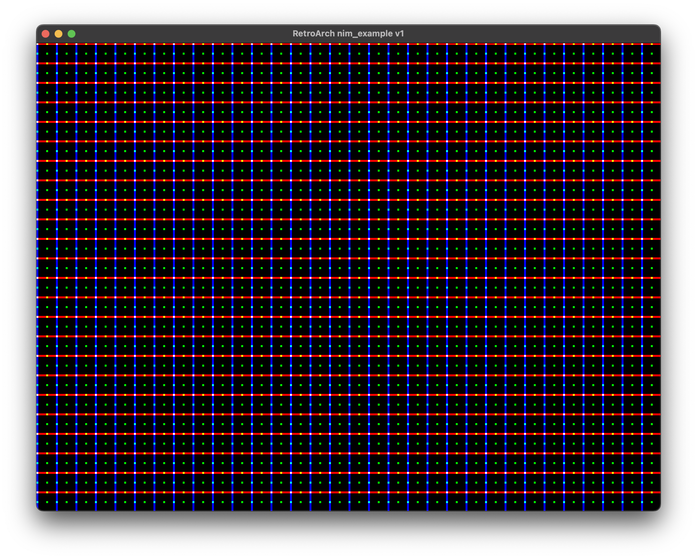

This is an example core, written in nim. This is a translation from [a basic software-rendering example](https://github.com/libretro/libretro-samples/tree/master/video/software/rendering) but you should be able to roughly translate any of the C examples into nim, with this example, as a guide.

The current demo is not quite an exact port, but proves x/y/color is working right:

```nim
proc retro_run*() {.cdecl,exportc,dynlib.} =
  for y in 0..239:
    for x in 0..319:
      var b = ((y * 320) + x) * 4
      buf[b  ] = 0x00 # B
      buf[b+1] = 0x00 # G
      buf[b+2] = 0x00 # R
      buf[b+3] = 0xFF # A
      # every 10 columns, make a blue pixel
      if x mod 10 == 0:
        buf[b] = 0xFF
      # every 10 rows, make a red pixel
      if y mod 10 == 0:
        buf[b + 2] = 0xFF
      # ever 5 pixels in both directions, make a green dot
      if y mod 5 == 0 and x mod 5 == 0:
        buf[b + 1] = 0xFF
  video_cb(buf, 320, 240, (320 shl 2))
```



## Usage

Put your core-code in `src/example_libretro.nim` and you can run these:

```
# install tools/libs
nimble install -d

# build the core
nimble core
```

You can run your core like this:

```
# mac
/Applications/RetroArch.app/Contents/MacOS/RetroArch -L example_libretro.dylib

# linux
retroarch -L example_libretro.so

# windows
retroarch -L example_libretro.dll
```

## C example

I included the original example in `c/example.c` to compare. If you don't need the C example, you can delete the file and remove the `example` task from `example_libretro.nimble`. It's basically just to show how to translate a C core into nim.

```
# build the C example core
nimble example

# mac
/Applications/RetroArch.app/Contents/MacOS/RetroArch -L example_libretro_c.dylib

# linux
retroarch -L example_libretro_c.so

# windows
retroarch -L example_libretro_c.dll
```
